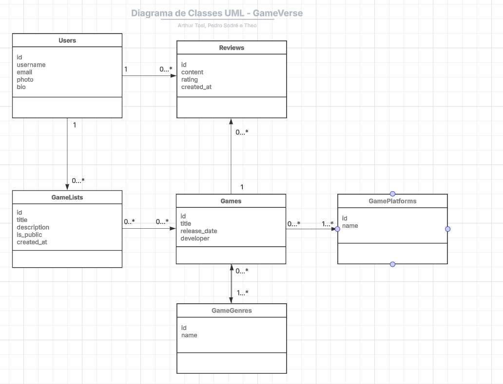

# GameVerse

- Obs: A documentação do back-end se encontra nesse repositório [https://github.com/PedroSodreUFES/gameverse-backend-pi]

## Diagrama de classes do domínio do problema



## Ferramentas escolhidas

- Versionamento de código: Git
- Teste unitários e de integração: Jest
- Issue tracking: Jira
- CI/CD: Github Actions
- Deploy front-end: Vercel
- Deploy back-end: Railway
- Containers: Docker
- Armazenamento de arquivos: Cloudfare R2

## Frameworks utilizados

- Next.js – Framework React para construção de aplicações web baseadas na biblioteca React
- Tailwind CSS – Framework utilitário para estilização com classes
- shadcn/ui – Framework de componentes estilizados com Tailwind
- React Hook Form – Framework para gerenciamento de formulários

## Como gerar a documentação do código

- Ferramenta utlizada: TypeDoc
  Para gerar a documentação do projeto, execute o seguinte comando:

```bash
npx typedoc
```

ou

```bash
pnpm run type-docs
```

Isso fará o TypeDoc ler o código Typescript do projeto, interpretar os comentários e os tipos do TS e gerar um arquivo (na pasta docs) contendo a documentação.

## Como executar o projeto

Certifique-se de ter instalado:

- [Node.js](https://nodejs.org/) (recomenda-se a versão LTS)
- [pnpm](https://pnpm.io/)

Para instalar o pnpm:

```bash
npm install -g pnpm
```

Instale as dependências com `pnpm`:

```bash
pnpm install
```

#### Configuração do ambiente

Crie um arquivo `.env.local` na raiz do projeto com o seguinte conteúdo:

```env
NEXT_PUBLIC_API_URL=localhost:8080
```

> Certifique-se de que sua API backend esteja rodando na porta 8080.

#### Executando o servidor de desenvolvimento

Inicie o servidor com o comando:

```bash
pnpm dev
```

Abra o navegador em [http://localhost:3000](http://localhost:3000) para ver o projeto em execução.
